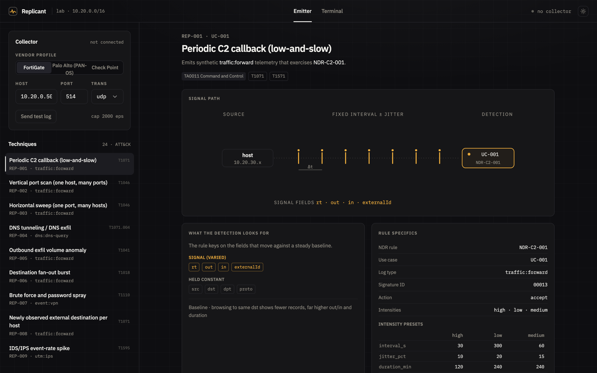
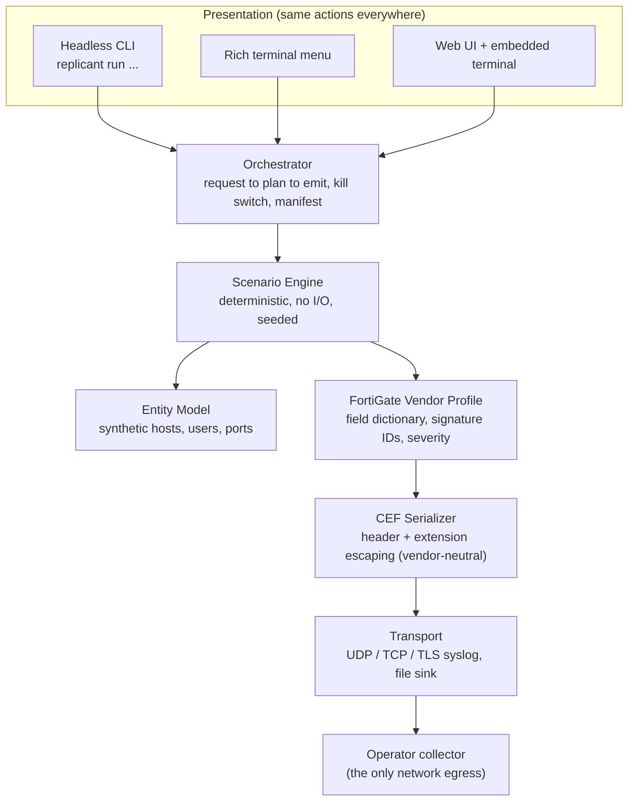
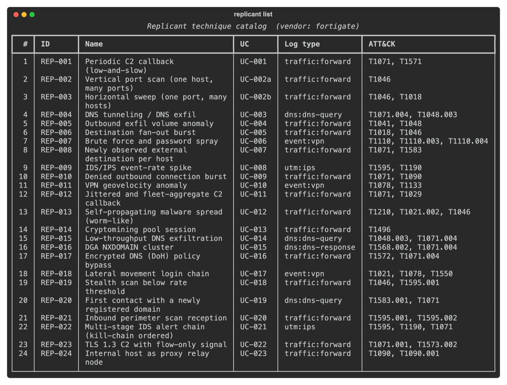
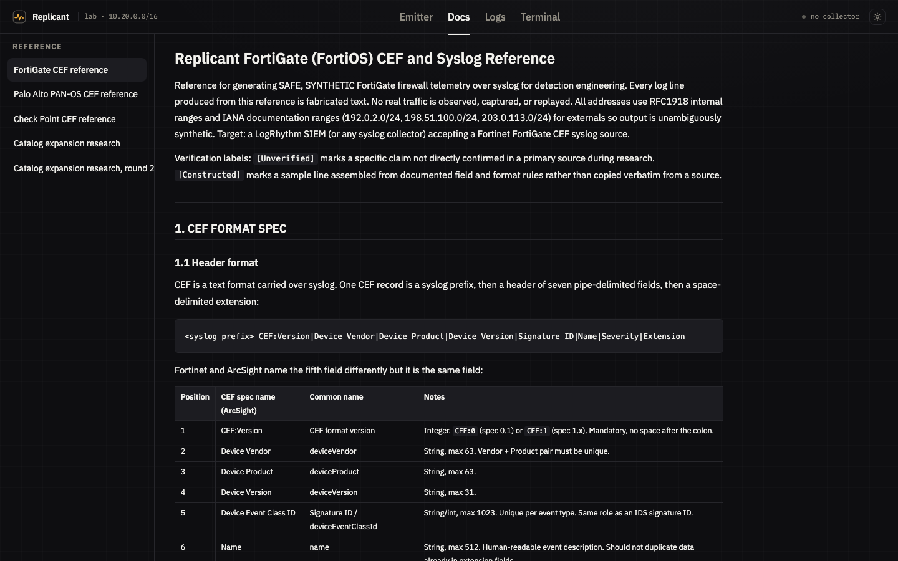
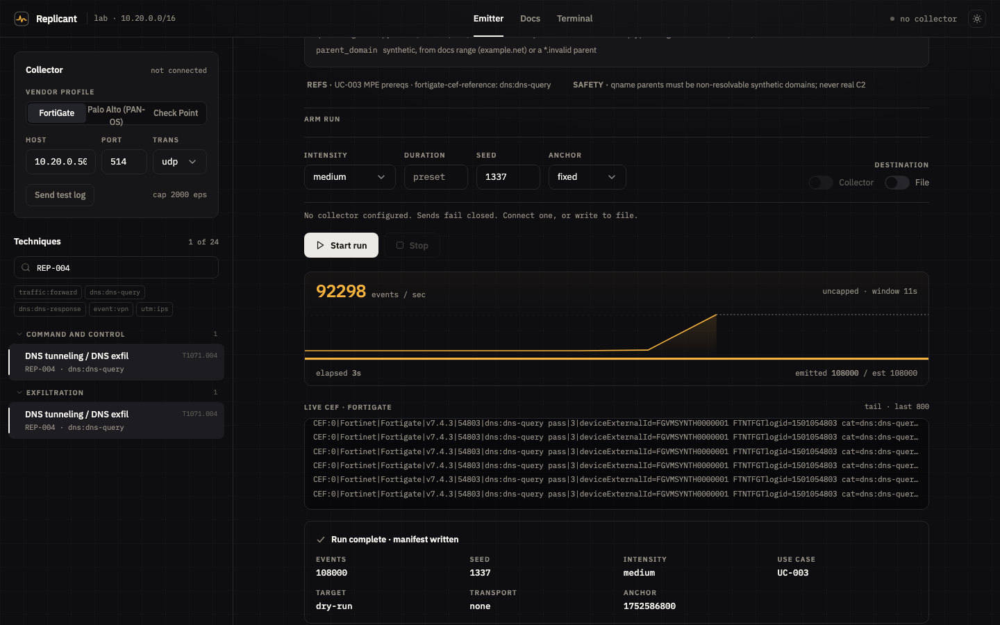
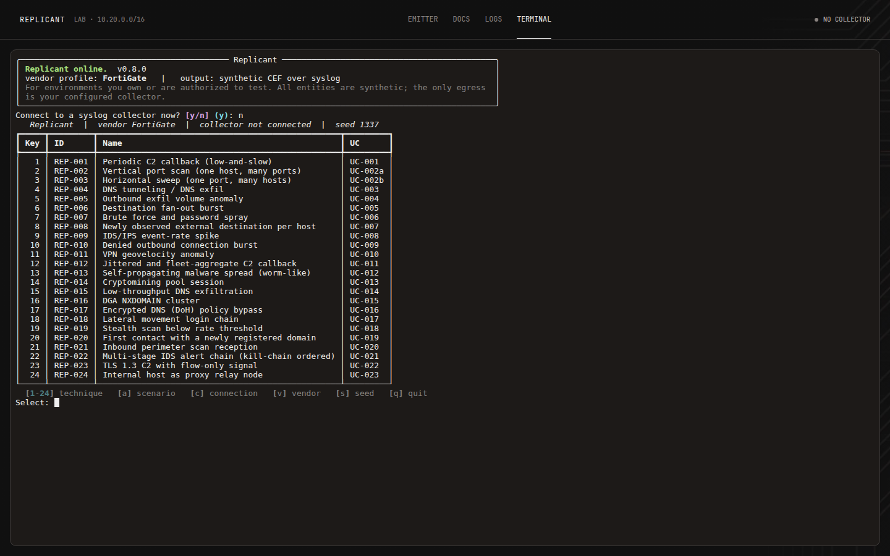

<div align="center">

# Replicant

**Safe, synthetic firewall telemetry for detection engineering.**

Replicant fabricates realistic firewall CEF logs for FortiGate, Palo Alto PAN-OS, and Check Point, streams them over syslog to your SIEM, and lets a detection engineer pick an ATT&CK-grounded technique from a menu to exercise the matching detection. It writes log text only. It never runs commands, scans hosts, resolves domains, or moves data.

> **Maturity: generator-verified, delivery-unverified.** Replicant's FortiGate CEF is byte-checked field-for-field against a golden oracle, so the *generator* is verified. End-to-end *delivery* to a live SIEM, and a detection actually firing on the result, have not been observed yet: every timing and delivery claim here is loopback-only until the first observed rule fire. See the [roadmap](#roadmap).

[](LICENSE)
[](pyproject.toml)
[](#what-the-output-looks-like)
[](#what-the-output-looks-like)
[](#safety-model)
[](tasks/todo.md)

<br />



<sub>Every technique carries its detection use case, the fields it holds constant, the fields it varies, and the shape of the signal a rule has to catch.</sub>

</div>

---

## Contents

- [The problem](#the-problem)
- [What Replicant is, and is not](#what-replicant-is-and-is-not)
- [How it works](#how-it-works)
- [Quick start](#quick-start)
- [What the output looks like](#what-the-output-looks-like)
- [Technique catalog](#technique-catalog)
- [Three ways to run it](#three-ways-to-run-it)
- [Safety model](#safety-model)
- [Determinism and testing](#determinism-and-testing)
- [Roadmap](#roadmap)
- [Prior art and positioning](#prior-art-and-positioning)
- [Attribution and license](#attribution-and-license)

---

## The problem

A detection is only as trustworthy as the last time you saw it fire. Detection engineers who want to validate a firewall rule usually face a choice: replay production captures (slow, sensitive, hard to shape), hand-craft a few log lines (brittle, not statistically realistic), or reach for a generic log generator (rarely accurate to a specific next-generation firewall on the wire).

Replicant takes a narrower, more useful position. It reproduces a specific firewall's CEF format field-for-field, streams it with realistic timing, and ties every generated behavior to a named detection use case, so the telemetry and the detection ship and get tested together. FortiGate is the verified profile and the trust anchor: its CEF is byte-checked field-for-field against a golden oracle. Palo Alto PAN-OS and Check Point ship as beta profiles, modeled from each vendor's public documentation but not yet confirmed against a live appliance (`[Unverified]`); clearing those markers is an open community-contribution ask for anyone with the hardware.

## What Replicant is, and is not

**Replicant is:**

- A fabricator of log text. Every output is a synthetic string sent to one operator-configured collector.
- Vendor-profile driven. FortiGate (FortiOS) was modeled first, field-for-field, against a documented CEF reference; Palo Alto PAN-OS and Check Point followed. Each profile has its own reference doc with golden sample lines used as the correctness oracle.
- A validation harness whose technique catalog maps one-to-one to detection use cases.
- Deterministic and seedable, so a run is reproducible for tests and for the analyst reviewing it.
- Open-source detection-as-code tooling for detection engineers, CLI-first. The web UI is an optional extra; anything the menu does, `replicant run ...` does headless. Apache-2.0, no vendor affiliation.

**Replicant is not:**

- An attack tool. It never executes commands, never scans real hosts, never resolves or contacts real infrastructure, and never moves real data. Attack names and byte counts are fields in a log line, nothing more.
- A packet crafter. It writes application-layer log records, not raw network traffic.

Use Replicant only in environments you own or are authorized to test.

## How it works

The presentation layer (a headless CLI, a Rich terminal menu, and a web UI) calls a single Orchestrator. The Orchestrator resolves a request into a deterministic event plan, renders each event through a vendor profile and a vendor-neutral CEF serializer, and sends it to the configured transport. Adding a new firewall vendor means implementing one profile interface plus a reference file; the Scenario Engine and CEF serializer stay vendor-neutral.



The rule that holds the design together: no behavior lives only in one interface. Anything the menu or the web UI can do, `replicant run ...` can do headless.

## Quick start

Requires Python 3.11 or newer.

```bash
git clone https://github.com/404SecNotFound/Replicant.git
cd Replicant
python3.12 -m venv .venv
./.venv/bin/pip install -e ".[dev]"
```

### Linux one-shot install

On a fresh Linux box, `scripts/install.sh` does the whole setup and then verifies it:

```bash
git clone https://github.com/404SecNotFound/Replicant.git
cd Replicant
./scripts/install.sh
```

It checks prerequisites first and, if any are missing, prints exactly what it will install and asks before touching the system. It then creates `.venv`, installs Replicant, builds the web UI, and proves the install works by loading the catalog, rendering CEF to a file, and sending a run over loopback UDP.

Flags: `--no-web` (CLI only), `--dev` (dev extra), `--yes` (non-interactive), `--dry-run` (show every action, change nothing).

The installer resolves prerequisites by asking your package manager what it would actually install, **before** it asks for sudo. If nothing on offer can reach Python 3.11, it refuses and tells you what to do rather than installing packages that would not help.

| Distribution | Status |
|---|---|
| Debian 13, Fedora | Full install including the web UI. Verified on Debian 13, which ships Node 20. |
| Debian 12, Ubuntu 24.04 | CLI installs cleanly. Both ship Node 18, which the web UI's toolchain no longer accepts, so use `--no-web` or install Node 20+ from NodeSource first. Verified on Debian 12. |
| RHEL / Rocky / Alma 9 | CLI installs cleanly (resolves Python 3.12). The web UI needs Node 20+, so either run `sudo dnf module enable nodejs:20` first or use `--no-web`. Verified on Rocky 9. |
| Ubuntu 22.04, Debian 11, RHEL / Rocky / Alma 8 | Refused, with guidance. These ship Python 3.10 or older, and Ubuntu 22.04 offers `python3.11` only as a release candidate. Add the deadsnakes PPA (Ubuntu) or a versioned package, then re-run. Verified on Ubuntu 22.04. |

Verified means the installer was executed against that distribution's live package repositories. [Unverified] on Alma, on RHEL proper as distinct from Rocky, and on Arch and openSUSE, whose package mappings are carried over unchanged and unexercised. The interactive consent prompt and the `sudo` elevation path are also [Unverified], since the container runs that validated the rest execute as root.

Installing pulls packages from your distribution, PyPI, and npm. That is install-time egress and is separate from the runtime rule that Replicant's only network egress is the collector you configure.

List the catalog, send a test log to a collector, then run a technique:

```bash
replicant list
replicant connect --host 10.20.0.50 --port 514 --transport udp --test
replicant run REP-001 --intensity medium --duration 30m --seed 1337
```

Preview a technique to a file with no network egress:

```bash
replicant run REP-004 --intensity high --duration 15m --to-file ./out/dns.log --no-send
```

Stream over TLS to a collector (use `--tls-cafile` for a private CA, or `--tls-insecure` for a lab self-signed certificate):

```bash
replicant connect --host 10.20.0.50 --port 6514 --transport tls --tls-cafile ./ca.pem --test
replicant run REP-007 --intensity high --duration 8m --host 10.20.0.50 --port 6514 --transport tls
```

Emit the same technique as another vendor's CEF instead of FortiGate. `--vendor` also works on `connect`, and the vendor is selectable in the Rich menu (`[v]`) and the web UI:

```bash
replicant run REP-009 --intensity high --vendor paloalto   --to-file ./out/panos.log      --no-send
replicant run REP-009 --intensity high --vendor checkpoint --to-file ./out/checkpoint.log --no-send
```

Palo Alto renders to PAN-OS CEF ([`docs/paloalto-cef-reference.md`](docs/paloalto-cef-reference.md)) and Check Point to Log Exporter CEF ([`docs/checkpoint-cef-reference.md`](docs/checkpoint-cef-reference.md)). Both reference docs are `[Unverified]` against a live build and each carries eight golden sample lines that reuse the same synthetic entities as the FortiGate oracle for direct comparison.

Compose several techniques into one ordered, multi-stage attack chain that shares a synthetic through-line (one victim host, one adversary IP), then preview its coverage or emit the merged CEF timeline:

```bash
replicant scenario list
replicant scenario show SCEN-001
replicant scenario run SCEN-001 --seed 1337 --to-file ./out/s1.log --no-send

# ask the whole chain to fit a window, then deliver it over that window
replicant scenario run SCEN-003 --duration 2h --anchor now --pace plan --host 10.20.0.50
```

Every scenario run writes an advisory coverage document beside its manifest: it maps the chain to ATT&CK tactics, names the cross-stage correlation key, and flags uncovered tactics. The advisory is context only; you author the detection design.

## What the output looks like

Each vendor profile renders the same technique into its own CEF dialect. Taking FortiGate as the example: vendor `Fortinet`, product `Fortigate` (lower-case g, matching real FortiOS output), signature ID taken from the last five digits of the FortiOS `logid`, severity as the reversed FortiOS level, and native fields with no standard CEF key carried under an `FTNTFGT` prefix. A traffic accept record looks like this (the syslog prefix is added by the transport layer and is not part of the CEF payload):

```
CEF:0|Fortinet|Fortigate|v7.4.3|00013|traffic:forward accept|3|deviceExternalId=FGVMSYNTH0000001 FTNTFGTlogid=0000000013 cat=traffic:forward FTNTFGTsubtype=forward FTNTFGTlevel=notice FTNTFGTvd=root FTNTFGTeventtime=1752661924 src=10.20.30.40 spt=51544 deviceInboundInterface=port2 dst=203.0.113.25 dpt=443 deviceOutboundInterface=port1 proto=6 act=accept FTNTFGTpolicyid=7 FTNTFGTservice=HTTPS app=HTTPS FTNTFGTtrandisp=snat externalId=48213 FTNTFGTduration=122 out=8421 in=61325 FTNTFGTsentpkt=64 FTNTFGTrcvdpkt=58
```

The field order, escaping rules, and signature IDs are pinned to the seven constructed sample lines in [`docs/fortigate-cef-reference.md`](docs/fortigate-cef-reference.md). Those lines are the correctness oracle: a test reproduces each of them byte-for-byte from the profile and serializer.

## Technique catalog

The catalog is the single source of truth for the menu, the CLI, and the engine. Each entry names the detection use case it exercises and its MITRE ATT&CK techniques. Signature IDs marked unverified must be confirmed on a live FortiOS build before customer use.

| ID | Technique | FortiGate log | Use case | ATT&CK | Status |
|----|-----------|---------------|----------|--------|--------|
| REP-001 | Periodic C2 callback (low-and-slow) | traffic:forward accept | UC-001 | T1071, T1571 | Implemented |
| REP-002 | Vertical port scan | traffic:forward deny | UC-002a | T1046 | Implemented |
| REP-003 | Horizontal sweep | traffic:forward deny | UC-002b | T1046, T1018 | Implemented |
| REP-004 | DNS tunneling / DNS exfil | dns:dns-query | UC-003 | T1071.004, T1048.003 | Implemented |
| REP-005 | Outbound exfil volume anomaly | traffic:forward | UC-004 | T1041, T1048 | Implemented |
| REP-006 | Destination fan-out burst | traffic:forward | UC-005 | T1018, T1046 | Implemented |
| REP-007 | Brute force and password spray | event:vpn | UC-006 | T1110, T1110.001, T1110.003 | Implemented |
| REP-008 | Newly observed external destination | traffic:forward | UC-007 | T1071, T1583 | Implemented |
| REP-009 | IDS/IPS event-rate spike | utm:ips | UC-008 | T1595, T1190 | Implemented |
| REP-010 | Denied outbound connection burst | traffic:forward | UC-009 | T1071, T1090 | Implemented |
| REP-011 | VPN geovelocity anomaly | event:vpn | UC-010 | T1078, T1133 | Implemented |
| REP-012 | Jittered and fleet-aggregate C2 callback | traffic:forward accept | UC-011 | T1071 | Implemented |
| REP-013 | Self-propagating malware spread | traffic:forward | UC-012 | T1210, T1021.002, T1046 | Implemented |
| REP-014 | Cryptomining pool session | traffic:forward accept | UC-013 | T1496 | Implemented |
| REP-015 | Low-throughput DNS exfiltration | dns:dns-query | UC-014 | T1048.003, T1071.004 | Implemented |
| REP-016 | DGA NXDOMAIN cluster | dns:dns-response | UC-015 | T1568.002, T1071.004 | Implemented |
| REP-017 | Encrypted DNS (DoH) policy bypass | traffic:forward + dns:dns-query | UC-016 | T1572, T1071.004 | Implemented |
| REP-018 | Lateral movement login chain | event:vpn + event:system + traffic:forward | UC-017 | T1021, T1078, T1550 | Implemented |
| REP-019 | Stealth scan below rate threshold | traffic:forward deny | UC-018 | T1046, T1595.001 | Implemented |
| REP-020 | First contact with a newly registered domain | dns:dns-query | UC-019 | T1583.001, T1071 | Implemented |
| REP-021 | Inbound perimeter scan reception | traffic:forward deny (inbound) | UC-020 | T1595.001, T1595.002 | Implemented |
| REP-022 | Multi-stage IDS alert chain | utm:ips | UC-021 | T1595, T1190, T1071 | Implemented |
| REP-023 | TLS 1.3 C2 with flow-only signal | traffic:forward accept | UC-022 | T1071.001, T1573.002 | Implemented |
| REP-024 | Internal host as proxy relay node | traffic:forward | UC-023 | T1090, T1090.001 | Implemented |

REP-012 through REP-024 are each anchored to a peer-reviewed detection paper with
measured results, so the generated pattern reflects what a published detector
actually keys on rather than a plausible guess. The anchors, the evidence, and the
ideas that were considered and rejected are recorded in
[docs/technique-catalog-expansion-research.md](docs/technique-catalog-expansion-research.md)
and [round 2](docs/technique-catalog-expansion-research-round2.md).

Several of them are deliberately the hard version of an earlier entry, so the pair
grades a detection rather than just firing it. REP-001 is a fixed-interval callback
that any periodicity test catches; REP-012 widens the jitter and spreads a rare
callback across a fleet so the period exists only in the aggregate. REP-004 is a
DNS tunnel at 20 to 200 queries per second; REP-015 runs at queries per hour,
under the thresholds REP-004 trips. REP-002 and REP-003 trip any scan rule;
REP-019 stays below the threshold on purpose.

Where a detection depends on separating the signal from a look-alike, the plan
emits the look-alike too. A run that contained only the malicious pattern would let
any rule score perfectly and teach you nothing, so REP-014 ships a bursty benign
long session, REP-018 an admin star pattern against its chain, REP-022 unrelated
alert noise around its ordered chain, and REP-024 a sanctioned proxy with an
identical traffic shape.

Each technique produces a statistically shaped stream rather than flat constants. REP-001 holds the source, destination, port, and protocol constant while varying byte sizes and session identifiers on a fixed interval with jitter. REP-003 holds one source and one port while sweeping many unique destination hosts, mostly denied. REP-004 emits high-entropy query names under one synthetic parent domain with query types weighted toward TXT and NULL.

## Three ways to run it

All three call the same Orchestrator. Anything the menu can do, `replicant run` can do headless.

### Headless CLI

`replicant list`, `replicant connect`, `replicant run`, and `replicant scenario` cover the full workflow for scripting and CI.



### Rich terminal menu

`replicant menu` gives an interactive flow: connect to a collector, send a test log, select a technique or a multi-stage scenario, set intensity and duration, and watch a live run counter.

### Web UI with an embedded terminal

`replicant web` serves a browser interface on port 9787.

```bash
pip install -e ".[web]"
(cd webui && npm install && npm run build)
replicant web        # http://127.0.0.1:9787/
```

To reach it from another machine on the segment, bind an address that machine can route to and open `http://<this-host>:9787/`:

```bash
replicant web --host 0.0.0.0 --no-browser
```

The access token is printed on startup, persists in `~/.config/replicant/web-token` so the URL survives a restart, and is exchanged for an httpOnly `SameSite=Strict` session cookie on first load, so it does not stay in the address bar. Rotate it with `--rotate-token`. Add a hostname the UI should answer to with `--allowed-host`, repeatable.

The Terminal tab is a real pseudo-terminal running the same `replicant menu` over a websocket, so the interactive menu is available inside the browser. Because it is a real PTY, it is **off by default** whenever the bind address is not loopback; `--enable-terminal` turns it back on. The CLI and the Rich menu cover everything the tab does, so leaving it off costs nothing in the common case.

At 24 techniques the left rail is grouped by ATT&CK tactic, collapsible, with a count per group; a technique mapped to several tactics appears under each. Above it, one filter box matches technique id, name, use case id, and ATT&CK technique id at the same time, so whichever identifier your detection backlog happens to use will find the entry. Toggles narrow by log type (`traffic:forward`, `dns:dns-query`, `dns:dns-response`, `event:vpn`, `utm:ips`).

The **Docs** tab renders the reference material in `docs/` in the browser: the three vendor CEF references and the two catalog expansion research notes. Those files ship with the repository rather than the installed package, so the tab is populated from a git checkout or an editable install and says so plainly if they are absent.



The run form exposes the event-time anchor as a visible control, `now` or `fixed`, defaulting to `now` for a live send and `fixed` for file output, and warns before the run if a live send is about to go out with a fixed anchor. See [Event times, and when to override the anchor](#event-times-and-when-to-override-the-anchor) for why that matters.

To run it as a service, `scripts/replicant-web.service` is a systemd unit template. Edit the user and the two paths at the top, then:

```bash
sudo cp scripts/replicant-web.service /etc/systemd/system/
sudo systemctl daemon-reload
sudo systemctl enable --now replicant-web
sudo cat /opt/replicant/.config/replicant/web-token   # the token to open the UI with
```

The banner prints the token only when it is attached to a terminal. Under systemd, stdout is the journal, and `journalctl` is readable by root and the systemd-journal group, so the token is deliberately kept out of it and read from the file instead. CI runs the unit under a real systemd on every push and asserts exactly that, along with the restart behaviour and the token's permissions.

> **Keeping it loopback-only.** That is still the default: plain `replicant web` binds 127.0.0.1 and nothing else. To reach a loopback-only instance from your workstation, tunnel it rather than rebinding: `ssh -N -L 9787:127.0.0.1:9787 operator@sensor`.

A run streams live CEF while it emits, plots the emission rate, and writes its manifest when it finishes. The readout says `uncapped` here because this run has no collector: the events-per-second cap governs sending, so a dry run or a file-only run is not throttled and the rate goes as fast as the machine allows. Point the same run at a collector and the readout shows `cap 2000` instead.



The Terminal tab, when enabled, runs the Rich menu inside the browser:



The UI is deliberately dark-only: a terminal war room built to sit beside a dark SIEM console. Machine values, labels, and status tags speak in JetBrains Mono; human sentences and hero numerics in Geist; and the two chromatic colors, signal orange and metric green, are reserved for live data and never appear on buttons, navigation, or headings. Every contrast pair was measured on the rendered page, not on the token table. The design contract is `docs/webui-factory-design.md`.

Below 1024px the fixed-viewport shell becomes an ordinary scrolling page and the left rail becomes a disclosure panel labelled with the armed technique, so the run stage is not squeezed into a few hundred pixels on a laptop or a tablet. Wide content, a long CEF line or a vendor reference table, scrolls inside its own container rather than dragging the page sideways.

The frontend is React, Vite, TypeScript, and Tailwind with shadcn-style components.

## Safety model

Safety is a design constraint, not a disclaimer. The guarantees below are enforced in code and covered by tests.

| Guarantee | How it is enforced |
|-----------|--------------------|
| Single destination | A run sends only to the collector the operator configures. There is no other socket target, and sends fail closed when no collector is set. |
| Synthetic entities only | Address pools are RFC1918 and IANA documentation ranges (192.0.2.0/24, 198.51.100.0/24, 203.0.113.0/24). A configuration that reaches outside these ranges is rejected at build time. DNS parents are drawn from the IANA documentation domains and the reserved `.invalid` TLD (RFC 6761). Replicant never resolves them, and never emits a real domain. |
| No real behavior | The engine performs no I/O and issues no attack. It produces log strings; byte counts and attack names are field values. |
| Rate limits | A configurable events-per-second cap protects the operator's own collector. No two sends are ever closer than `1/cap`, and that floor is measured against the previous **actual** send rather than against a schedule, so it holds even when the host runs late. It composes with `--pace` rather than competing: pacing sets the shape of the run, the cap sets the floor on spacing. **The cap is applied by one process's emit loop, so the supported scope is one sending run per host**, and that is enforced rather than assumed: a second sending run is refused while the first holds the slot, naming the pid that has it. `--no-send` and `--to-file` never acquire it, because they cannot reach a collector. Two *hosts* pointed at one collector are still two caps; nothing on this machine can see that. |
| Audit trail | Every run writes a manifest recording seed, technique, parameters, entity pools, target, event count, and start and end times in UTC+04:00. |

The web server adds its own controls. It binds to loopback by default, and requires a token on every API and websocket call, accepted as an `Authorization: Bearer` header, an `X-Replicant-Token` header, a query parameter, or an httpOnly `SameSite=Strict` session cookie. It rejects any request whose `Host` is neither the bind address, nor loopback, nor a name passed to `--allowed-host`. Because the cookie is the one credential a browser attaches on its own, a state-changing request authenticated by the cookie must also carry a matching `Origin`; the websocket repeats those checks itself, since websocket scopes do not traverse HTTP middleware.

Binding to a routable address is supported and turns the embedded terminal tab off by default. `--no-auth` is refused outright on a non-loopback bind unless `--i-understand-this-is-unauthenticated` is also passed. The server speaks plain HTTP, so the token and the traffic are readable on the wire: put it on a management segment, or behind a TLS-terminating proxy named with `--allowed-host`.

## Determinism and testing

The Scenario Engine does no I/O and is seeded, so the same seed plus technique plus parameters yields the same event stream. Event times are computed from a fixed anchor plus a deterministic offset, so a run written to a file is byte-identical across runs. That property makes both the tool and the detections it exercises reproducible.

### Event times, and when to override the anchor

Read this before pointing Replicant at a SIEM for the first time.

That fixed anchor is what makes runs byte-identical, and it is also a trap on a live send. The syslog header is stamped at send time, while the CEF `eventtime` stays at the anchor, so the two disagree by however long ago the anchor is. Whether it matters depends on your SIEM:

- **Keys on receipt time:** the run looks normal, rules fire.
- **Keys on the parsed event time:** the events land outside every recent-window rule and **nothing fires**, which looks exactly like a broken detection.

Use `--anchor` to emit at the current time:

```bash
replicant run REP-001 --anchor now --host 10.20.0.50 --port 514
replicant scenario run SCEN-001 --anchor now --host 10.20.0.50 --port 514
```

`--anchor` accepts `now`, an epoch, or an ISO-8601 timestamp (a naive value is read as UTC). Sending with an anchor more than two days from now prints a warning naming the drift, so this cannot bite you silently. Leave the anchor alone for `--to-file` artifacts and regression comparisons, where byte-identical output is the point.

The web UI exposes the same choice as an **Anchor** control in the run form, defaulting to `now` for a live send and `fixed` for file output, and shows the consequence before you start the run rather than after.

### Pacing: when the events actually leave

The anchor decides what time an event *claims*. Pacing decides when it *arrives*, and the two have to agree or an interval-keyed rule has nothing to work with.

A plan carries a per-event time. REP-001 at low intensity is 49 events spread over 238 minutes, and Replicant used to send all 49 as fast as the rate cap allowed: a three second burst carrying four hours of timestamps. A beacon rule asking for N callbacks at a regular interval over M minutes sees every callback at once, so it never fires, or fires on the wrong shape.

```bash
replicant run REP-001 --anchor now --pace plan --host 10.20.0.50   # 4h beacon takes 4h
replicant run REP-001 --anchor now --pace plan --speed 60 --host 10.20.0.50   # 4h in 4m
replicant run REP-001 --anchor now --pace burst --host 10.20.0.50  # all at once
```

- **`plan`** reproduces the plan's own gaps. Event time equals send time throughout, and nothing is future-dated. This is the default whenever events go to a collector.
- **`burst`** is the old behaviour: as fast as `--rate` allows, plan timeline ignored. The default for `--to-file`, where the wall clock means nothing.
- **`--speed N`** compresses the timeline **including the event times**, so the payload never claims a spread it did not deliver. The tradeoff is real and worth stating: compression preserves *relative* timing and changes *absolute* intervals, so a rule keyed on five minute gaps will not match a run compressed 60x. Use real time to validate a rule, a compressed run for a smoke test.

`--rate` is unrelated and unchanged. It is the events-per-second flood guard protecting your collector, and it acts as a floor on how close two sends can ever be, under either pace. Pacing sets the shape; rate sets the ceiling.

### Duration: how much of the behaviour to emulate

`--duration` says how long the simulated activity should last. It works on every one of the 24 techniques and on scenarios:

```bash
replicant run REP-001 --duration 2h --anchor now --pace plan --host 10.20.0.50        # 2h of C2 beacon
replicant scenario run SCEN-003 --duration 2h --anchor now --pace plan --host 10.20.0.50  # 2h kill chain
```

**Duration and `--speed` are not two ways of doing the same thing, and the difference decides whether a detection can fire.**

| | event count | intervals | use it for |
|---|---|---|---|
| `--duration 2h` | falls | **preserved** | pointing a rule at a shorter but genuine window |
| `--speed 6` | preserved | **divided by 6** | a fast smoke test, when interval fidelity does not matter |

A 2-hour C2 beacon under `--duration` is 24 callbacks five minutes apart. The same thing under `--speed` is 240 callbacks fifty seconds apart, which is not a beacon any interval-keyed rule will recognise. Where the gap between events *is* the signal, duration is what you want.

For a scenario, duration scales the stage offsets and each stage's own window together, so the kill chain keeps its order and its relative spacing while every technique inside it keeps its characteristic interval.

One thing deliberately resists scaling. A stage pinned to an absolute window answers to the clock rather than to the scenario: REP-005 is off-hours bulk transfer and off-hours is 00:00-06:00, so SCEN-001 cannot be compressed below that jump. The run says so in its manifest rather than quietly returning something longer than you asked for. Asking a single off-hours technique for more than six hours is capped at the window for the same reason.

The run form carries the same choice as a **Pacing** control, with both options priced from your actual plan (`Plan time 3h 58m` beside `Burst 0.2s`) and the consequence written underneath, so the duration is visible before you commit rather than discovered by watching a prompt not come back.

The suite covers CEF golden lines, the FortiGate profile, scenario determinism and distribution bounds, loopback UDP, TCP, and TLS transport, catalog validation, the orchestrator end-to-end, and the web API.

```bash
./.venv/bin/pytest          # 952 tests
(cd webui && npm test)      # 136 frontend tests
./.venv/bin/black --check replicant tests
./.venv/bin/ruff check replicant tests
./.venv/bin/mypy replicant
```

The loopback transport test stands up an in-process UDP, TCP, and TLS receiver, so continuous integration needs no external collector.

## Roadmap

- **Phase 1 (complete):** end-to-end pipeline plus three techniques (REP-001, REP-002, REP-004), FortiGate profile, UDP and TCP syslog, headless CLI, and the Rich menu.
- **Phase 1.5 (complete):** web UI and an embedded terminal over the same Orchestrator.
- **Phase 2 (complete):** all eleven techniques implemented (REP-001 through REP-011), the off-hours (00:00-06:00) start pinning used by REP-005, TLS syslog transport, and a warm-up baseline for REP-008 whose boundary is recorded in the run manifest.
- **Phase 3 (complete):** multi-vendor. Palo Alto (PAN-OS) and Check Point (Log Exporter) profiles join FortiGate, each with an `[Unverified]` reference doc and byte-for-byte golden lines. Select the vendor with `--vendor {fortigate,paloalto,checkpoint}`, in the Rich menu (`[v]`), or in the web UI; one technique catalog and one scenario engine drive every vendor, only the serialization differs.
- **Phase 4 (complete):** ATT&CK scenario composition. Curated scenarios compose the existing techniques into one deterministic, multi-stage CEF timeline with a shared synthetic through-line, plus an advisory coverage document that maps the chain to ATT&CK tactics and flags gaps. Any AI assistance stays advisory while a human authors the detection design. Driven from `replicant scenario` (list/show/run) and the Rich menu `[a]`.
- **Catalog expansion (complete):** the catalog grew from 11 techniques to 24 (REP-012 through REP-024), each anchored to a peer-reviewed detection paper with measured results rather than to a plausible guess. Added the `dns:dns-response` render path on all three vendors, which also makes fast-flux and DNS TTL techniques possible later, and a dedicated inbound-scanner entity pool. Several new entries are the graded, harder counterpart of an existing one, and techniques whose detection depends on separating a signal from a look-alike now emit the look-alike as well.
- **Web UI access and navigation (complete):** the UI serves on a fixed port and can bind an address the rest of the segment can reach, with a persistent token, an httpOnly session cookie, a Host allowlist that follows the bind address, and the embedded terminal off by default once the bind is not loopback. The left rail is grouped by ATT&CK tactic with a filter box and log-type toggles, a Docs tab renders the vendor CEF references in the browser, and the event-time anchor is a visible control in the run form.
- **Light theme and responsive layout (complete, light theme since removed):** the web UI briefly shipped a measured light palette alongside the dark one; the Factory redesign below made the UI dark-only and removed it. The responsive half survives: below 1024px the fixed-viewport shell becomes an ordinary scrolling page and the left rail becomes a disclosure panel; wide content such as CEF samples and the reference tables scrolls inside its own container rather than pushing the page sideways.
- **Factory redesign (complete):** the web UI's visual system is the archived dark-era Factory design, "terminal war room at midnight": Geist and JetBrains Mono (both OFL, self-hosted with their licenses), the #101010/#ee6018 palette on a single dark theme, weight 400 everywhere, no gradients or shadows, chromatic color reserved for live data, and the run panel rebuilt as a dashboard frame with an instrumented sparkline. Design contract: `docs/webui-factory-design.md`.
- **Next (hard launch gate):** the LogRhythm lab test. Every timing and delivery claim above is loopback-only; the headline "exercises the matching detection" has never been observed end to end. Until the first observed rule fire, the honest posture is "generates vendor-accurate CEF, detection-unverified." Nothing that adds surface ships before the pipe is proven. Decision record: [`docs/roadmap-2026-09.md`](docs/roadmap-2026-09.md).
- **Community ask:** the Palo Alto and Check Point profiles stay beta until their `[Unverified]` references are confirmed against a live appliance. FortiGate is already the verified oracle; clearing the other two needs real hardware, so it is an open contribution path for anyone who runs those platforms.

## Prior art and positioning

Replicant is not the first synthetic log generator, and it does not claim to be. Two projects shaped its design: Cisco Talos EvidenceForge (MIT), a strong permissive engine that writes batch dataset files and is host-centric with Cisco ASA as its only firewall output, and summved/log-generator (GPL-3.0), which streams generic firewall CEF over syslog with ATT&CK chains. Neither code base is reused here.

Replicant's contribution is narrower and specific: next-generation-firewall-accurate CEF modeled on a real vendor schema, alignment with a specific SIEM's parser expectations, live streaming with realistic timing, an explicit safety model, and a technique catalog mapped to a specific detection pack.

The sharpest contrast is with on-wire test tools. AlphaSOC Network Flight Simulator (`flightsim`) is what a detection engineer usually reaches for to exercise network detections, and it works by emitting real DNS, HTTP, and other traffic to real external infrastructure. Replicant aims at the same class of network detections from the opposite side of the wire: it opens exactly one fail-closed socket to the operator's own collector and never touches real infrastructure, real hosts, or real DNS. Same detections in view, none of the wire risk. That safety model is the differentiator on shared or production-adjacent segments, and it is the axis where a log-strings-only generator is both stronger and safer than a traffic emitter.

## Attribution and license

This project uses MITRE ATT&CK. (c) 2026 The MITRE Corporation. This work is reproduced and distributed with the permission of The MITRE Corporation. ATT&CK is a registered trademark of The MITRE Corporation. Use does not imply endorsement.

**Replicant is an independent project with no vendor affiliation.** It is not affiliated with, sponsored by, or endorsed by Fortinet, Palo Alto Networks, Check Point, Open Text (ArcSight/CEF), or Exabeam (LogRhythm). Fortinet, FortiGate and FortiOS are trademarks of Fortinet, Inc.; Palo Alto Networks and PAN-OS of Palo Alto Networks, Inc.; Check Point of Check Point Software Technologies Ltd. Those names appear here only to identify whose log format a given output imitates, which is the one thing a detection engineer needs to know about it. No vendor logos or brand assets are used.

Every record Replicant emits is fabricated: events that did not happen, on devices that do not exist, using RFC 1918 and IANA documentation addresses. The vendor reference documents in [`docs/`](docs/) were written from each vendor's public documentation, cited per file, and their sample lines are `[Constructed]` from the documented field rules rather than copied from vendor examples. That claim is verified, not just asserted: see [section 3 of the prior-art and licensing review](docs/prior-art-and-licensing.md).

Replicant is licensed under the [Apache License 2.0](LICENSE). Design acknowledgements and third-party notices are in [`NOTICE`](NOTICE). The design blueprint, the FortiGate CEF reference, and the prior-art review are in [`docs/`](docs/).
