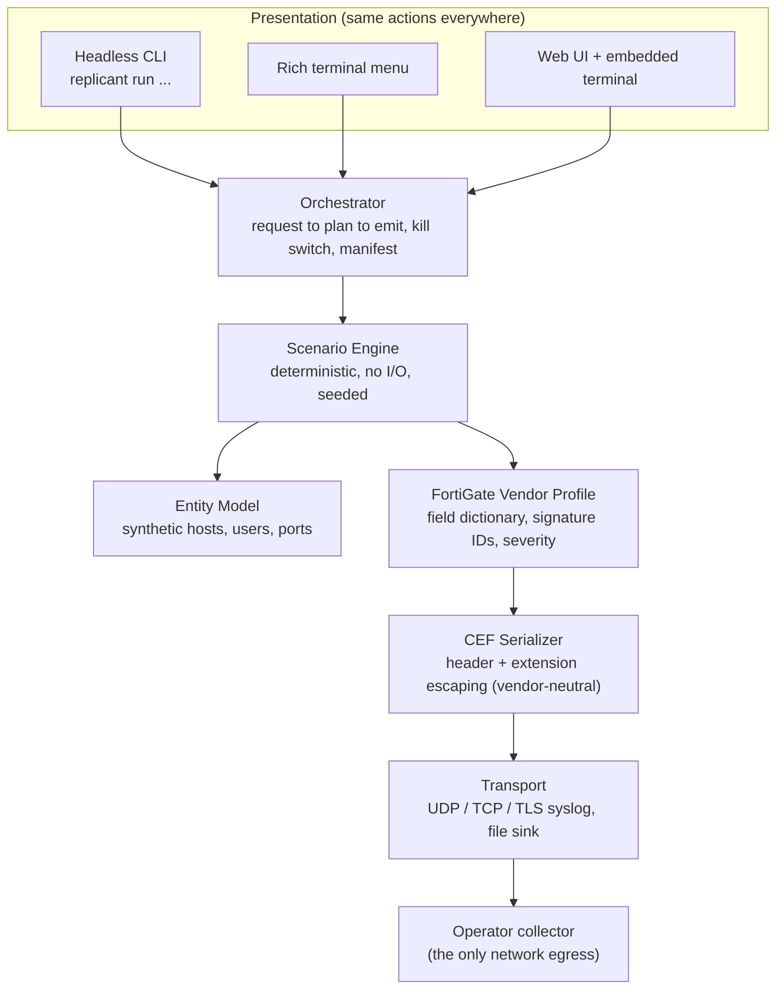

<div align="center">

# Replicant

**Safe, synthetic firewall telemetry for detection engineering.**

Replicant fabricates realistic firewall CEF logs for FortiGate, Palo Alto PAN-OS, and Check Point, streams them over syslog to your SIEM, and lets a detection engineer pick an ATT&CK-grounded technique from a menu to exercise the matching detection. It writes log text only. It never runs commands, scans hosts, resolves domains, or moves data.

[](LICENSE)
[](pyproject.toml)
[](#what-the-output-looks-like)
[](#safety-model)
[](tasks/todo.md)

<br />


<sub>Every technique carries its detection use case, the fields it holds constant, the fields it varies, and the shape of the signal a rule has to catch.</sub>

</div>

---

## Contents

- [The problem](#the-problem)
- [What Replicant is, and is not](#what-replicant-is-and-is-not)
- [How it works](#how-it-works)
- [Quick start](#quick-start)
- [What the output looks like](#what-the-output-looks-like)
- [Technique catalog](#technique-catalog)
- [Three ways to run it](#three-ways-to-run-it)
- [Safety model](#safety-model)
- [Determinism and testing](#determinism-and-testing)
- [Roadmap](#roadmap)
- [Prior art and positioning](#prior-art-and-positioning)
- [Attribution and license](#attribution-and-license)

---

## The problem

A detection is only as trustworthy as the last time you saw it fire. Detection engineers who want to validate a firewall rule usually face a choice: replay production captures (slow, sensitive, hard to shape), hand-craft a few log lines (brittle, not statistically realistic), or reach for a generic log generator (rarely accurate to a specific next-generation firewall on the wire).

Replicant takes a narrower, more useful position. It reproduces a specific firewall's CEF format field-for-field, streams it with realistic timing, and ties every generated behavior to a named detection use case, so the telemetry and the detection ship and get tested together. Three vendor profiles ship today: FortiGate, Palo Alto PAN-OS, and Check Point.

## What Replicant is, and is not

**Replicant is:**

- A fabricator of log text. Every output is a synthetic string sent to one operator-configured collector.
- Vendor-profile driven. FortiGate (FortiOS) was modeled first, field-for-field, against a documented CEF reference; Palo Alto PAN-OS and Check Point followed. Each profile has its own reference doc with golden sample lines used as the correctness oracle.
- A validation harness whose technique catalog maps one-to-one to detection use cases.
- Deterministic and seedable, so a run is reproducible for tests and for the analyst reviewing it.

**Replicant is not:**

- An attack tool. It never executes commands, never scans real hosts, never resolves or contacts real infrastructure, and never moves real data. Attack names and byte counts are fields in a log line, nothing more.
- A packet crafter. It writes application-layer log records, not raw network traffic.

Use Replicant only in environments you own or are authorized to test.

## How it works

The presentation layer (a headless CLI, a Rich terminal menu, and a web UI) calls a single Orchestrator. The Orchestrator resolves a request into a deterministic event plan, renders each event through a vendor profile and a vendor-neutral CEF serializer, and sends it to the configured transport. Adding a new firewall vendor means implementing one profile interface plus a reference file; the Scenario Engine and CEF serializer stay vendor-neutral.



The rule that holds the design together: no behavior lives only in one interface. Anything the menu or the web UI can do, `replicant run ...` can do headless.

## Quick start

Requires Python 3.11 or newer.

```bash
git clone https://github.com/404SecNotFound/Replicant.git
cd Replicant
python3.12 -m venv .venv
./.venv/bin/pip install -e ".[dev]"
```

### Linux one-shot install

On a fresh Linux box, `scripts/install.sh` does the whole setup and then verifies it:

```bash
git clone https://github.com/404SecNotFound/Replicant.git
cd Replicant
./scripts/install.sh
```

It checks prerequisites first and, if any are missing, prints exactly what it will install and asks before touching the system. It then creates `.venv`, installs Replicant, builds the web UI, and proves the install works by loading the catalog, rendering CEF to a file, and sending a run over loopback UDP.

Flags: `--no-web` (CLI only), `--dev` (dev extra), `--yes` (non-interactive), `--dry-run` (show every action, change nothing).

The installer resolves prerequisites by asking your package manager what it would actually install, **before** it asks for sudo. If nothing on offer can reach Python 3.11, it refuses and tells you what to do rather than installing packages that would not help.

| Distribution | Status |
|---|---|
| Debian 12, Ubuntu 24.04+, Fedora | Full install including the web UI. Verified on Debian 12. |
| RHEL / Rocky / Alma 9 | CLI installs cleanly (resolves Python 3.12). The web UI needs Node 18+, so either run `sudo dnf module enable nodejs:20` first or use `--no-web`. Verified on Rocky 9. |
| Ubuntu 22.04, Debian 11, RHEL / Rocky / Alma 8 | Refused, with guidance. These ship Python 3.10 or older, and Ubuntu 22.04 offers `python3.11` only as a release candidate. Add the deadsnakes PPA (Ubuntu) or a versioned package, then re-run. Verified on Ubuntu 22.04. |

Verified means the installer was executed against that distribution's live package repositories. [Unverified] on Alma, on RHEL proper as distinct from Rocky, and on Arch and openSUSE, whose package mappings are carried over unchanged and unexercised. The interactive consent prompt and the `sudo` elevation path are also [Unverified], since the container runs that validated the rest execute as root.

Installing pulls packages from your distribution, PyPI, and npm. That is install-time egress and is separate from the runtime rule that Replicant's only network egress is the collector you configure.

List the catalog, send a test log to a collector, then run a technique:

```bash
replicant list
replicant connect --host 10.20.0.50 --port 514 --transport udp --test
replicant run REP-001 --intensity medium --duration 30m --seed 1337
```

Preview a technique to a file with no network egress:

```bash
replicant run REP-004 --intensity high --duration 15m --to-file ./out/dns.log --no-send
```

Stream over TLS to a collector (use `--tls-cafile` for a private CA, or `--tls-insecure` for a lab self-signed certificate):

```bash
replicant connect --host 10.20.0.50 --port 6514 --transport tls --tls-cafile ./ca.pem --test
replicant run REP-007 --intensity high --duration 8m --host 10.20.0.50 --port 6514 --transport tls
```

Emit the same technique as another vendor's CEF instead of FortiGate. `--vendor` also works on `connect`, and the vendor is selectable in the Rich menu (`[v]`) and the web UI:

```bash
replicant run REP-009 --intensity high --vendor paloalto   --to-file ./out/panos.log      --no-send
replicant run REP-009 --intensity high --vendor checkpoint --to-file ./out/checkpoint.log --no-send
```

Palo Alto renders to PAN-OS CEF ([`docs/paloalto-cef-reference.md`](docs/paloalto-cef-reference.md)) and Check Point to Log Exporter CEF ([`docs/checkpoint-cef-reference.md`](docs/checkpoint-cef-reference.md)). Both reference docs are `[Unverified]` against a live build and each carries seven golden sample lines that reuse the same synthetic entities as the FortiGate oracle for direct comparison.

Compose several techniques into one ordered, multi-stage attack chain that shares a synthetic through-line (one victim host, one adversary IP), then preview its coverage or emit the merged CEF timeline:

```bash
replicant scenario list
replicant scenario show SCEN-001
replicant scenario run SCEN-001 --seed 1337 --to-file ./out/s1.log --no-send
```

Every scenario run writes an advisory coverage document beside its manifest: it maps the chain to ATT&CK tactics, names the cross-stage correlation key, and flags uncovered tactics. The advisory is context only; you author the detection design.

## What the output looks like

Each vendor profile renders the same technique into its own CEF dialect. Taking FortiGate as the example: vendor `Fortinet`, product `Fortigate` (lower-case g, matching real FortiOS output), signature ID taken from the last five digits of the FortiOS `logid`, severity as the reversed FortiOS level, and native fields with no standard CEF key carried under an `FTNTFGT` prefix. A traffic accept record looks like this (the syslog prefix is added by the transport layer and is not part of the CEF payload):

```
CEF:0|Fortinet|Fortigate|v7.4.3|00013|traffic:forward accept|3|deviceExternalId=FGVMSYNTH0000001 FTNTFGTlogid=0000000013 cat=traffic:forward FTNTFGTsubtype=forward FTNTFGTlevel=notice FTNTFGTvd=root FTNTFGTeventtime=1752661924 src=10.20.30.40 spt=51544 deviceInboundInterface=port2 dst=203.0.113.25 dpt=443 deviceOutboundInterface=port1 proto=6 act=accept FTNTFGTpolicyid=7 FTNTFGTservice=HTTPS app=HTTPS FTNTFGTtrandisp=snat externalId=48213 FTNTFGTduration=122 out=8421 in=61325 FTNTFGTsentpkt=64 FTNTFGTrcvdpkt=58
```

The field order, escaping rules, and signature IDs are pinned to the seven constructed sample lines in [`docs/fortigate-cef-reference.md`](docs/fortigate-cef-reference.md). Those lines are the correctness oracle: a test reproduces each of them byte-for-byte from the profile and serializer.

## Technique catalog

The catalog is the single source of truth for the menu, the CLI, and the engine. Each entry names the detection use case it exercises and its MITRE ATT&CK techniques. Signature IDs marked unverified must be confirmed on a live FortiOS build before customer use.

| ID | Technique | FortiGate log | Use case | ATT&CK | Status |
|----|-----------|---------------|----------|--------|--------|
| REP-001 | Periodic C2 callback (low-and-slow) | traffic:forward accept | UC-001 | T1071, T1571 | Implemented |
| REP-002 | Vertical port scan | traffic:forward deny | UC-002a | T1046 | Implemented |
| REP-003 | Horizontal sweep | traffic:forward deny | UC-002b | T1046, T1018 | Implemented |
| REP-004 | DNS tunneling / DNS exfil | dns:dns-query | UC-003 | T1071.004, T1048.003 | Implemented |
| REP-005 | Outbound exfil volume anomaly | traffic:forward | UC-004 | T1041, T1048 | Implemented |
| REP-006 | Destination fan-out burst | traffic:forward | UC-005 | T1018, T1046 | Implemented |
| REP-007 | Brute force and password spray | event:vpn | UC-006 | T1110 | Implemented |
| REP-008 | Newly observed external destination | traffic:forward | UC-007 | T1071, T1583 | Implemented |
| REP-009 | IDS/IPS event-rate spike | utm:ips | UC-008 | T1595, T1190 | Implemented |
| REP-010 | Denied outbound connection burst | traffic:forward | UC-009 | T1071, T1090 | Implemented |
| REP-011 | VPN geovelocity anomaly | event:vpn | UC-010 | T1078, T1133 | Implemented |

Each technique produces a statistically shaped stream rather than flat constants. REP-001 holds the source, destination, port, and protocol constant while varying byte sizes and session identifiers on a fixed interval with jitter. REP-003 holds one source and one port while sweeping many unique destination hosts, mostly denied. REP-004 emits high-entropy query names under one synthetic parent domain with query types weighted toward TXT and NULL.

## Three ways to run it

All three call the same Orchestrator. Anything the menu can do, `replicant run` can do headless.

### Headless CLI

`replicant list`, `replicant connect`, `replicant run`, and `replicant scenario` cover the full workflow for scripting and CI.


### Rich terminal menu

`replicant menu` gives an interactive flow: connect to a collector, send a test log, select a technique or a multi-stage scenario, set intensity and duration, and watch a live run counter.

### Web UI with an embedded terminal

`replicant web` serves a browser interface on a random loopback port.

```bash
pip install -e ".[web]"
(cd webui && npm install && npm run build)
replicant web        # prints http://127.0.0.1:<port>/?token=...
```

A run streams live CEF while it emits, with the delivered rate plotted against your events-per-second cap:


The Terminal tab is a real pseudo-terminal running the same `replicant menu` over a websocket, so the interactive menu is available inside the browser:


The frontend is React, Vite, TypeScript, and Tailwind with shadcn-style components.

## Safety model

Safety is a design constraint, not a disclaimer. The guarantees below are enforced in code and covered by tests.

| Guarantee | How it is enforced |
|-----------|--------------------|
| Single destination | A run sends only to the collector the operator configures. There is no other socket target, and sends fail closed when no collector is set. |
| Synthetic entities only | Address pools are RFC1918 and IANA documentation ranges (192.0.2.0/24, 198.51.100.0/24, 203.0.113.0/24). A configuration that reaches outside these ranges is rejected at build time. DNS parents are non-resolvable synthetic names. |
| No real behavior | The engine performs no I/O and issues no attack. It produces log strings; byte counts and attack names are field values. |
| Rate limits | A configurable events-per-second cap protects the operator's own collector. It is a fixed-window average, not an instantaneous ceiling: sends run at full speed until a one-second window fills, then pause, so a sliding second straddling a boundary can briefly exceed the cap. |
| Audit trail | Every run writes a manifest recording seed, technique, parameters, entity pools, target, event count, and start and end times in UTC+04:00. |

The web server adds its own controls: it binds to loopback only, requires a per-session token on every API and websocket call, and rejects requests whose Host header is not localhost.

## Determinism and testing

The Scenario Engine does no I/O and is seeded, so the same seed plus technique plus parameters yields the same event stream. Event times are computed from a fixed anchor plus a deterministic offset, so a run written to a file is byte-identical across runs. That property makes both the tool and the detections it exercises reproducible.

The suite covers CEF golden lines, the FortiGate profile, scenario determinism and distribution bounds, loopback UDP, TCP, and TLS transport, catalog validation, the orchestrator end-to-end, and the web API.

```bash
./.venv/bin/pytest          # 235 tests
./.venv/bin/black --check replicant tests
./.venv/bin/ruff check replicant tests
./.venv/bin/mypy replicant
```

The loopback transport test stands up an in-process UDP, TCP, and TLS receiver, so continuous integration needs no external collector.

## Roadmap

- **Phase 1 (complete):** end-to-end pipeline plus three techniques (REP-001, REP-002, REP-004), FortiGate profile, UDP and TCP syslog, headless CLI, and the Rich menu.
- **Phase 1.5 (complete):** web UI and an embedded terminal over the same Orchestrator.
- **Phase 2 (complete):** all eleven techniques implemented (REP-001 through REP-011), the off-hours weighting used by REP-005, TLS syslog transport, and a warm-up baseline for REP-008 whose boundary is recorded in the run manifest.
- **Phase 3 (complete):** multi-vendor. Palo Alto (PAN-OS) and Check Point (Log Exporter) profiles join FortiGate, each with an `[Unverified]` reference doc and byte-for-byte golden lines. Select the vendor with `--vendor {fortigate,paloalto,checkpoint}`, in the Rich menu (`[v]`), or in the web UI; one technique catalog and one scenario engine drive every vendor, only the serialization differs.
- **Phase 4 (complete):** ATT&CK scenario composition. Curated scenarios compose the existing techniques into one deterministic, multi-stage CEF timeline with a shared synthetic through-line, plus an advisory coverage document that maps the chain to ATT&CK tactics and flags gaps. Any AI assistance stays advisory while a human authors the detection design. Driven from `replicant scenario` (list/show/run) and the Rich menu `[a]`.

## Prior art and positioning

Replicant is not the first synthetic log generator, and it does not claim to be. Two projects shaped its design: Cisco Talos EvidenceForge (MIT), a strong permissive engine that writes batch dataset files and is host-centric with Cisco ASA as its only firewall output, and summved/log-generator (GPL-3.0), which streams generic firewall CEF over syslog with ATT&CK chains. Neither code base is reused here.

Replicant's contribution is narrower and specific: next-generation-firewall-accurate CEF modeled on a real vendor schema, alignment with a specific SIEM's parser expectations, live streaming with realistic timing, an explicit safety model, and a technique catalog mapped to a specific detection pack.

## Attribution and license

This project uses MITRE ATT&CK. (c) 2026 The MITRE Corporation. This work is reproduced and distributed with the permission of The MITRE Corporation. ATT&CK is a registered trademark of The MITRE Corporation. Use does not imply endorsement.

Replicant is licensed under the [Apache License 2.0](LICENSE). Design acknowledgements and third-party notices are in [`NOTICE`](NOTICE). The design blueprint, the FortiGate CEF reference, and the prior-art review are in [`docs/`](docs/).
